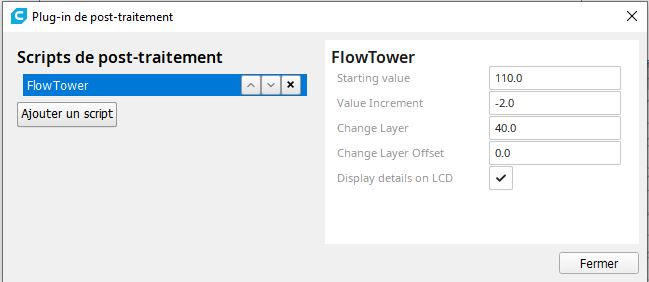

# Calibration Shapes

This plugin adds a menu to create some simple shapes to the scene (cube, cylinder, tube) and calibration sample parts. They are used most of the time to create some fast test parts and common calibration/test parts. 

The default size for all the simple shapes is 20 mm, but can be modified via the [**Define default size**](#Define-default-size) menu.

## Calibration part

You can also load standard test  / calibration  part :

| Wiki Page                                                                                                       | Stl Model                                                       |
|:---------------------------------------------------------------------------------------------------------------:|:---------------------------------------------------------------:|
| [Calibration Cube XYZ](https://github.com/5axes/Calibration-Shapes/wiki/Calibration-Cube-XYZ)                   | [Calibration Cube XYZ](./models/CalibrationCube.stl)            |
| [PLA  TempTower 220 - 180°C](https://github.com/5axes/Calibration-Shapes/wiki/PLA-TempTower-220---180°C)        | [PLA  TempTower 220 - 180°C](./models/TempTowerPLA.stl)         |
| [PLA  TempTower 220 - 190°C](https://github.com/5axes/Calibration-Shapes/wiki/PLA-TempTower-220---190°C)        | [PLA  TempTower 220 - 190°C](./models/TempTowerPLA190°C.stl)    |
| [PLA+ TempTower 230 - 200°C](https://github.com/5axes/Calibration-Shapes/wiki/PLA+-TempTower-230---200°C)       | [PLA+ TempTower 230 - 200°C](./models/TempTowerPLA+.stl)        |
| [ABS  TempTower 250 - 210°C](https://github.com/5axes/Calibration-Shapes/wiki/ABS-TempTower-250---210°C)        | [ABS  TempTower 250 - 210°C](./models/TempTowerABS.stl)         |
| [PETG TempTower 260 - 230°C](https://github.com/5axes/Calibration-Shapes/wiki/PETG-TempTower-260---230°C)       | [PETG TempTower 260 - 230°C](./models/TempTowerPETG.stl)        |
| [Retract Tower](https://github.com/5axes/Calibration-Shapes/wiki/Retract-Tower)                                 | [Retract Tower](./models/RetractTower.stl)                      |
| [Acceleration Tower](https://github.com/5axes/Calibration-Shapes/wiki/Acceleration-&-Ringing-Tower)             | [Acceleration Tower](./models/AccelerationTower.stl)            |
| [Retract Test part](https://github.com/5axes/Calibration-Shapes/wiki/Retract-Test-part)                         | [Retract Test part](./models/RetractTest.stl)                   |
| [XY Calibration Test part](https://github.com/5axes/Calibration-Shapes/wiki/XY-Calibration-Test-part)           | [XY Calibration Test part](./models/xy_calibration.stl)         |
| [Bridge Spiral test](https://github.com/5axes/Calibration-Shapes/wiki/Bridge-Spiral-test)                       | [Bridge Spiral test](./models/BridgeTest.stl)                   |
| [Thin Wall Test](https://github.com/5axes/Calibration-Shapes/wiki/Thin-Wall-Test)                               | [Thin Wall Test](./models/ThinWall.stl)                         |
| [Overhang Test](https://github.com/5axes/Calibration-Shapes/wiki/Overhang-Test)                                 | [Overhang Test](./models/Overhang.stl)                          |
| [Flow Test](https://github.com/5axes/Calibration-Shapes/wiki/Flow-Test)                                         | [Flow Test](./models/FlowTest.stl)                              |
| [Tower Flow Test](https://github.com/5axes/Calibration-Shapes/wiki/FlowTower-Test)                              | [TowerFlow Test](./models/Flow-tower-04x02.stl)                 |
| [Hole Test](https://github.com/5axes/Calibration-Shapes/wiki/Hole-Test)                                         | [Hole Test](./models/HoleTest.stl)                              |
| [Linear/Pressure Advance Tower](https://github.com/5axes/Calibration-Shapes/wiki/Linear-Pressure-Advance-Tower) | [Linear/Pressure Adv Tower](./models/PressureAdvTower.stl)      |
| [Junction Deviation Tower](https://github.com/5axes/Calibration-Shapes/wiki/Junction-Deviation-Tower)           | [Junction Deviation Tower](./models/JunctionDeviationTower.stl) |
| [Tolerance Test](https://github.com/5axes/Calibration-Shapes/wiki/Tolerance)                                    | [Tolerance Test](./models/Tolerance.stl)                        |
| [Support Test](https://github.com/5axes/Calibration-Shapes/wiki/Support-Test)                                   | [Support Test](./models/SupportTest.stl)                        |
| [Lithophane Test](https://github.com/5axes/Calibration-Shapes/wiki/Lithophane-Test)                                   | [Lithophane Test](./models/Lithophane.stl)                        |
| [Dimensional Accuracy Test](https://github.com/5axes/Calibration-Shapes/wiki/Dimensional-Accuracy-Test)         | [Dimensional Accuracy](./models/DimensionalAccuracyTest.stl)    |
| [MultiCube Test](https://github.com/5axes/Calibration-Shapes/wiki/MultiCube)                                    | [MultiCube Test](./models/MultiCube.stl)                        |

Multi flow parts : For this parts the initial design is scaled to the nozzle size

| Wiki Page                                                                                               | Stl Model                                                |
|:-------------------------------------------------------------------------------------------------------:|:--------------------------------------------------------:|
| [Parametric Multi Flow test](https://github.com/5axes/Calibration-Shapes/wiki/MultiFlowTest) | [Flow 100%](./models/Flow100.stl) |

Bed Level : For this part the initial design is scaled to the bed size

| Wiki Page                                                                                               | Stl Model                                                |
|:-------------------------------------------------------------------------------------------------------:|:--------------------------------------------------------:|
| [Parametric Bed Level Calibration](https://github.com/5axes/Calibration-Shapes/wiki/ParametricBedLevel) | [Bed Level Calibration](./models/ParametricBedLevel.stl) |

Multi-Extruder Calibration part

- [Cube bi-color](https://github.com/5axes/Calibration-Shapes/wiki/Cube-Bi-Color)
- [Calibration Cube bi-color](https://github.com/5axes/Calibration-Shapes/wiki/CubeCalibrationBiColor)
- [Extruder Offset Calibration](https://github.com/5axes/Calibration-Shapes/wiki/ExtruderOffsetCalibration)

All the parts have been designed via OpenSCAD. OpenSCAD can be downloaded [here](http://www.openscad.org/downloads.html)

### Define default size

The function **Define default size** gives you the possibility to change the default size for the standard primitives (cube/cylinder/tube).

This plugin is using the [Trimesh](https://github.com/mikedh/trimesh) library to create [simple shapes](https://github.com/mikedh/trimesh/blob/master/trimesh/creation.py) and to load STL files.

## Cura-Postprocessing-Scripts

Several postprocessing Scripts are included into the plugin to help the user to generate automaticaly the differents Towers.

- [RetractTower.py](./resources/scripts/RetractTower.py)
- [SpeedTower.py](./resources/scripts/SpeedTower.py)
- [TempFanTower.py](./resources/scripts/TempFanTower.py)
- [FlowTower.py](./resources/scripts/FlowTower.py)

### Copy Scripts

These scripts can be copied into the scripts directory via the function **Copy Scripts**.

**Note :** Since Cura 4.9 you don't need to use this function anymore. Has been removed from the menu.

**After you have copied these scripts, you must restart Cura to see the scripts in the postprocessing scripts list.**

### Tower generation scripts
The scripts provided with this plugin must be visible in the Postprocessing scripts list.

#### [SpeedTower.py](resources/scripts/SpeedTower.py)

Description :  postprocessing-script to easily define a Speed Tower.

Five options :

    - Jerk   :  Speed variation (M204 S) 
	
    - Acceleration :  Acceleration variation (M205 X Y) 
    
    - Junction Deviation :  Junction Deviation variation (M205 J) 
    
    - Marlin Linear  :  Marlin Linear Advance (M900 K)

    - RepRap Pressure  : RepRap Pressure Advance (M572 D0 S)

#### [TempFanTower.py](resources/scripts/TempFanTower.py)

Description:  postprocessing-script to easily create a temptower and not use 10 changeAtZ-scripts

 The default values are for this temptower PLA model : [PLA TempTower 220°C - 180°C](./models/TempTowerPLA.stl)
- Temp Tower PLA from 220°C to 180°C  (Other design possible to test PLA from 220°C to 190°C)
- Possibility to define also a Fan Tower , Fan percentage speed are defined with semi-colon as separator in the fan variation field

#### [RetractTower.py](resources/scripts/RetractTower.py)

Description:  postprocessing-script to easily create a Retract Tower

The default values are for this Retract Tower model : [Retract Tower](./models/RetractTower.stl)
 
Two options :

    - Speed   :  Speed variation
	
    - Retract :  Distance retract variation

#### [FlowTower.py](resources/scripts/FlowTower.py)

Description:  postprocessing-script to easily create a FlowTower

 The default values are for this FlowTower model : [FlowTower Nozzle 0.4 / Layer height 0.2](./models/Flow-tower-04x02.stl)
- FlowTower from 110% to 90% 
    - Using Flow Varation   :  [Flow Varation](https://marlinfw.org/docs/gcode/M221.html) (M221 S) 

## Add Mark

This function has been removed from the last versions and is now the subject of a specific plugin with many more possibilities. You can find the plugin at the following address: [Name It!](https://github.com/5axes/NameIt))

## Help

This function will redirect you on the [Wiki](https://github.com/5axes/Calibration-Shapes/wiki) of this repositery.
