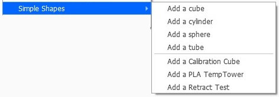

# SimpleShapes

This plugin adds a menu to create some simple shapes to the scene (cube, cylinder, sphere, tube). The default size for all these shapes is 20 mm.

Calibration part
--

You can also add standard test part / calibration :
- Calibration Cube XYZ
- PLA TempTower 220 - 180°C
- Retract Test part
- Retract Tower

All the parts have been designed via OpenSCAD. OpenSCAD can be downloaded [here](http://www.openscad.org/downloads.html)

Script part
--
A bunch of postprocessing Script are included into the plugin
- RetractTower.py
- SpeedTower.py
- TempFanTower.py

These scripts can be copied into the scripts directory via the function **Copy Scripts

Using [Trimesh](https://github.com/mikedh/trimesh) function for simple shapes [creation](https://github.com/mikedh/trimesh/blob/master/trimesh/creation.py).
