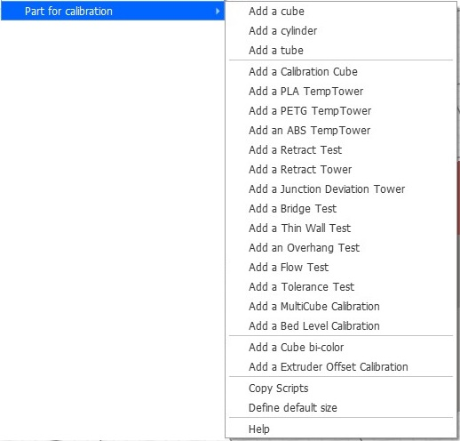
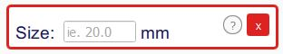
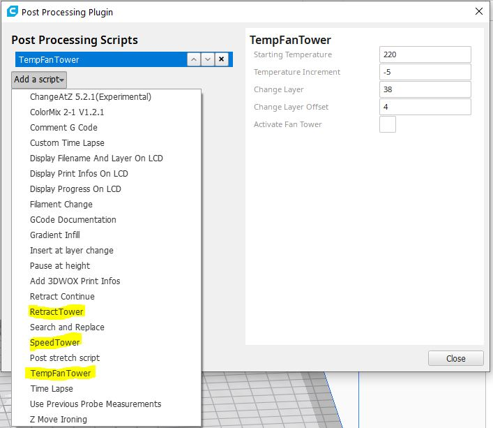
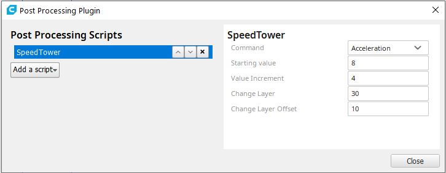
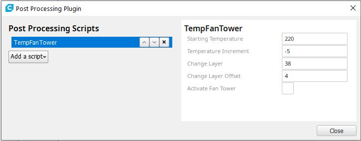
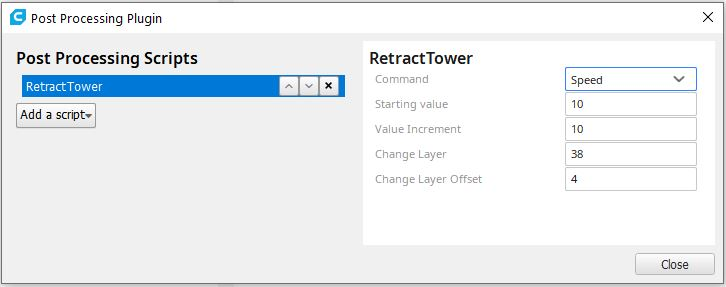

# Calibration Shapes

This plugin adds a menu to create some simple shapes to the scene (cube, cylinder, tube) used most of the time to create some fast test parts and common calibration/test parts. The default size for all the simple shapes is 20 mm, but can be modified via the **Define default size** menu.

Calibration part
--

You can also load standard test  / calibration  part :
- [Calibration Cube XYZ](./models/CalibrationCube.stl)
- [PLA  TempTower 220 - 180°C](./models/TempTowerPLA.stl)
- [PLA  TempTower 220 - 190°C](./models/TempTowerPLA190°C.stl)
- [PLA+ TempTower 230 - 200°C](./models/TempTowerPLA+.stl)
- [ABS  TempTower 250 - 210°C](./models/TempTowerABS.stl)
- [PETG TempTower 260 - 230°C](./models/TempTowerPETG.stl)
- [Retract Tower](./models/RetractTower.stl)
- [Retract Test part](./models/RetractTest.stl)
- [Bridge Spiral test](./models/BridgeTest.stl)
- [Thin Wall Test](./models/ThinWall.stl)
- [Overhang Test](./models/Overhang.stl)
- [Flow Test](./models/FlowTest.stl)
- [Hole Test](./models/HoleTest.stl)
- [Linear/Pressure Adv Tower](./models/PressureAdvTower.stl)
- [Junction Deviation Tower](./models/JunctionDeviationTower.stl)
- [Tolerance Test](./models/Tolerance.stl)
- [Support Test](./models/SupportTest.stl)
- [MultiCube Test](./models/MultiCube.stl)

Bed Level : For this part the initial design is scaled to the bed size

- [Bed Level Calibration](./models/ParametricBedLevel.stl)

Multi-Extruder Calibration part

- Cube bi-color
- Calibration Cube bi-color
- Extruder Offset Calibration

All the parts have been designed via OpenSCAD. OpenSCAD can be downloaded [here](http://www.openscad.org/downloads.html)

Define default size
--

The function **Define default size** gives you the possibility to change the default size for the standard primitives (cube/cylinder/tube).

This plugin is using the [Trimesh](https://github.com/mikedh/trimesh) library to create [simple shapes](https://github.com/mikedh/trimesh/blob/master/trimesh/creation.py) and to load STL files.

## Cura-Postprocessing-Scripts

Several postprocessing Scripts are included into the plugin to help the user to generate automaticaly the differents Towers.

- [RetractTower.py](./resources/RetractTower.py)
- [SpeedTower.py](./resources/SpeedTower.py)
- [TempFanTower.py](./resources/TempFanTower.py)

### Copy Scripts

**Note :** Since Cura 4.9 don't need to use this function anymore. Have been remove from the menu.

These scripts can be copied into the scripts directory via the function **Copy Scripts**. 

**After you have copied these scripts, you must restart Cura to see the scripts in the postprocessing scripts list.**

After the restart the scripts must be visible in the Postprocessing scripts list.

### Tower generation scripts
The scripts provided with this plugin must be visible in the Postprocessing scripts list.

SpeedTower.py
-----
Description:  postprocessing-script to easily define a Speed Tower.

Five options :

    - Jerk   :  Speed variation (M204 S) 
	
    - Acceleration :  Acceleration variation (M205 X Y) 
    
    - Junction Deviation :  Junction Deviation variation (M205 J) 
    
    - Marlin Linear  :  Marlin Linear Advance (M900 K)

    - RepRap Pressure  : RepRap Pressure Advance (M572 D0 S)

TempFanTower.py
-----

Description:  postprocessing-script to easily to create a temptower and not use 10 changeAtZ-scripts

 The default values are for this temptower PLA model : [PLA TempTower 220°C - 180°C](./models/TempTowerPLA.stl)
- Temp Tower PLA from 220°C to 180°C  (Other design possible to test PLA from 220°C to 190°C)
- Possibility to define also a Fan Tower , Fan percentage speed indicate with semi-colon as seprator

RetractTower.py
-----

Description:  postprocessing-script to easily create a Retract Tower

The default values are for this Retract Tower model : [Retract Tower](./models/RetractTower.stl)
 
Two options :

    - Speed   :  Speed variation
	
    - Retract :  Distance retract variation

Help
--

This function will redirect you on the [Wiki](https://github.com/5axes/Calibration-Shapes/wiki) of this repositery.
